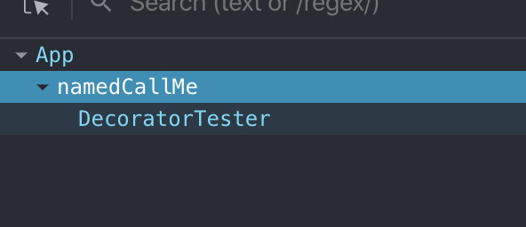

## 使用 babel 或 typescript 来编译 react 项目

Parcel 默认使用@babel/preset-env转换你的代码。我们可以添加 .babelrc 文件来进行进一步配置。
```json
{
  "plugins": [
    [
      "transform-decorators-legacy"
    ]
  ],
  "presets": [
    [
      "env",
      {
        "targets": {
          "browsers": [
            "last 2 versions",
            "safari >= 7"
          ]
        }
      }
    ],
    "react",
    "stage-0"
  ]
}
```

相关babel依赖应该已经自动被安装了。

接着我们参考react官网中高阶组件的一个例子，用装饰器语法来包装 DecoratorTester 组件，然后从外部传入组件名。

index.js
```jsx
const App = () => <div className="app-container">
  Hello React!
  <DecoratorTester name="CallMe" />
</div>;
```

/components/DecoratorTester.js
```jsx
@name
export default class DecoratorTester extends React.Component {
  render() {
    return <div>I'm the DecoratorTester</div>;
  }
}
```

/components/named.js
```jsx
export default function named(Component) {
  const NamedComponent = ({ name, ...restProps }) => {
    NamedComponent.displayName = `named${name || Component.displayName || Component.name || 'Component'}`;
    return <Component {...restProps} />;
  };
  return NamedComponent;
}
```

可以看到组件名已经被修改了



如果希望使用typescript来编译项目，将 .babelrc 改为 tsconfig.json 文件并修改配置就可以了，值得一提的是ts依赖的声明文件还是需要手动安装的。这里不再赘述。